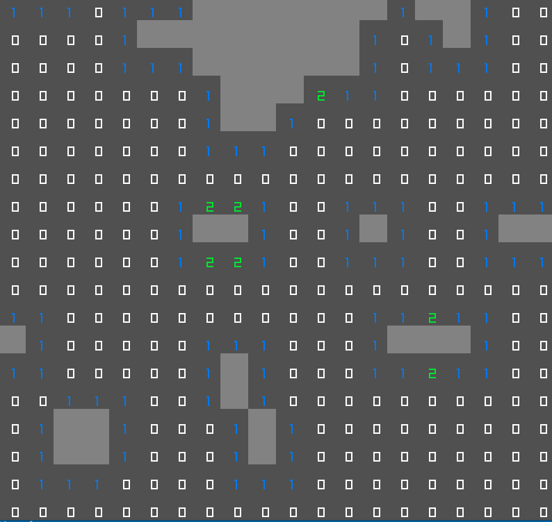

# Raylib-Minesweeper-rs

A very simple clone of minesweeper in rust and raylib-rs

## Running 

```
git clone --recursive https://github.com/MyUsernamee/Raylib-Minesweeper-rs.git
cd Raylib-Minesweeper-rs
cargo run --release
```

## Screenshots

